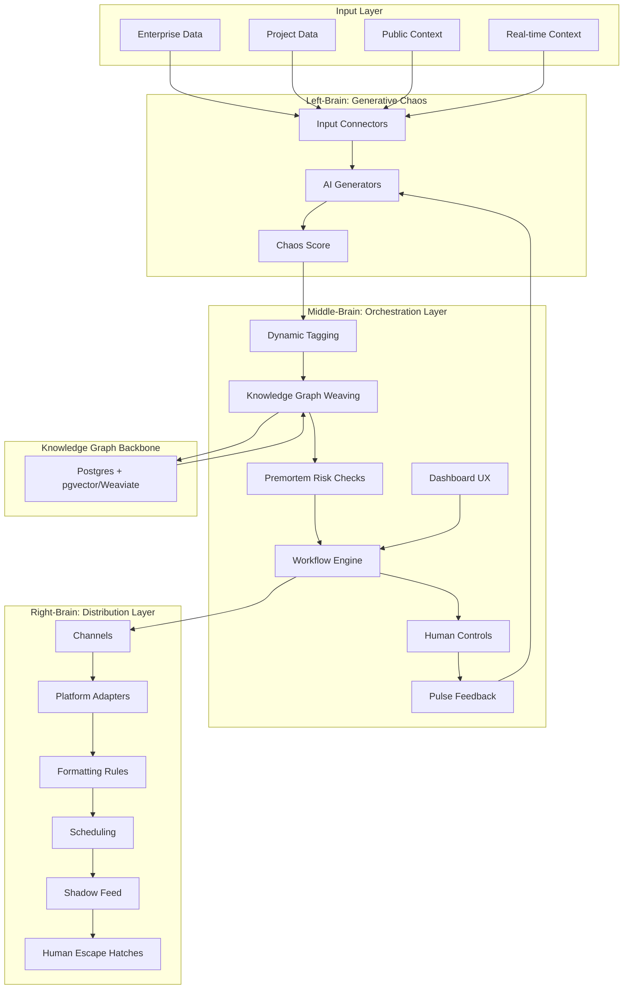

```mermaid
graph TD
    subgraph Input Layer
        A[Enterprise Data]
        B[Project Data]
        C[Public Context]
        D[Real-time Context]
    end

    subgraph Left-Brain: Generative Chaos
        E[Input Connectors]
        F[AI Generators]
        G[Chaos Score]
    end

    subgraph Middle-Brain: Orchestration Layer
        H[Dynamic Tagging]
        I[Knowledge Graph Weaving]
        J[Premortem Risk Checks]
        K[Workflow Engine]
        L[Human Controls]
        M[Pulse Feedback]
        N[Dashboard UX]
    end

    subgraph Right-Brain: Distribution Layer
        O[Channels]
        P[Platform Adapters]
        Q[Formatting Rules]
        R[Scheduling]
        S[Shadow Feed]
        T[Human Escape Hatches]
    end

    subgraph Knowledge Graph Backbone
        U[Postgres + pgvector/Weaviate]
    end

    A --> E
    B --> E
    C --> E
    D --> E
    E --> F
    F --> G
    G --> H
    H --> I
    I --> J
    J --> K
    K --> L
    K --> O
    L --> M
    M --> F
    N --> K
    O --> P
    P --> Q
    Q --> R
    R --> S
    S --> T
    I --> U
    U --> I
```
